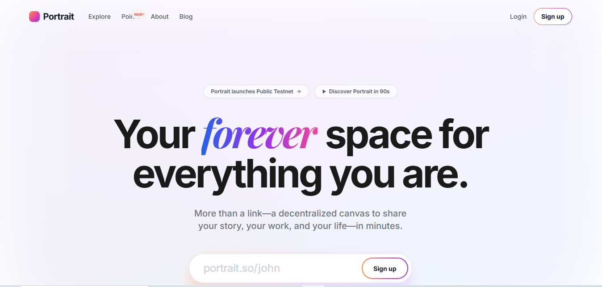

# 🎨 Portrait.so Landing Page Recreation


*A clean, high-fidelity recreation of the Portrait.so landing page.*

This project recreates the **Portrait.so** decentralized website builder landing page pixel-perfectly.
It showcases advanced UI interactions, 3D effects, and responsive layouts built with **Next.js 15**, **TypeScript**, and **Tailwind CSS**.


---

## 🚀 Live Demo

[View Live Demo](#)

---

## ✨ Key Features

### 💎 Advanced UI & Animations

* **3D Tilt Effects:** Scroll-triggered 3D perspective animations in the "Creating is Easy" section using CSS transforms and Framer Motion.
* **Physics-Based Fly-In Animations:** Hero section elements animate into the viewport with smooth spring physics.
* **Interactive Card Stack:** Community cards expand and shuffle on click, giving a dynamic interface experience.

### 📱 Responsive Design

* **Adaptive Network Diagram:**

  * Desktop: Complex curved SVG connections between nodes.
  * Mobile: Reflows into a vertical flex layout with CSS borders for clarity.
* **Mobile-Optimized Navigation:** Smooth collapsible menus with touch-friendly tap targets.

### ⚡ Modern Tech Stack

* **Next.js 15 (App Router) + React 19**
* **Tailwind CSS** with custom configurations for typography, gradients, and animations
* **TypeScript:** Fully type-safe for components and state management
* **Performance Optimized:** Modular components and optimized fonts (`next/font`)

---

## 💻 Getting Started

1. **Clone the repo**

```bash
git clone https://github.com/yourusername/portrait-landing.git
cd portrait-landing
```

2. **Install dependencies**

```bash
npm install
# or
yarn install
```

3. **Start the development server**

```bash
npm run dev
```

4. Open [http://localhost:3000](http://localhost:3000) in your browser.

---

## 📂 Project Structure

```bash
├── app/                  
│   ├── layout.tsx        # Root layout with fonts & metadata
│   ├── page.tsx          # Main landing page
│   └── globals.css       # Tailwind & global styles
├── components/           
│   ├── Hero.tsx          # Hero section animations
│   ├── NetworkDiagram.tsx# Responsive SVG/Flex network
│   ├── CreatingSection.tsx # 3D tilt animations
│   ├── CommunitySection.tsx # Interactive card stack
│   └── ...               # Navbar, FAQ, Footer
├── lib/                  # Utility functions
└── public/               # Static images & assets
```

### Design System

* **Typography:** Inter (Sans) + Playfair Display (Serif)
* **Colors:** Custom gradients & brand colors via Tailwind
* **Icons:** lucide-react

---

## 🤝 Contributing

Contributions, issues, and feature requests are welcome!

---

## 📄 License

This project is open-source under the **MIT License**.

<p align="center">Built with ❤️ by Muhammad Waheed</p>
